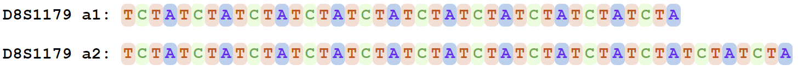
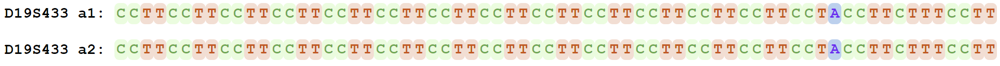

# TRcaller 2.0

## Updates

TRcaller 2.0 has been updated to the new version 2.0 for a better performance, higher accuracy, and easy usage. 

## The fastest and most accurate tandem repeat genotyping tool by far for both short and long Next Generation Sequencing reads from Illumina, PacBio and Nanopore.

# Install TRcaller
The software can be downloaded for a direct use. No additional compiling and installation. Get it from Github:

git clone https://github.com/XuewenWangUGA/TRcaller

or download the zip compressed files and then unzip to VarSeqStitcher

Update Java run environment if necessary
The software will use the Java runtime environment (SE) V17. 

If your computer has an old version of Java runtime, please install the newest Java or Java SE 17 or higher from https://www.oracle.com/java/technologies/downloads/. Either Java or Java SE should work. In this case, you should put path before java. e.g.
the dwonloaded java binary is in c:/java21/bin; then type the command to run TRcaller as the followings:

`javaPath=c:/java21/bin`
`$javaPath/java -jar TRcallerv2.0.jar `

# Quick start

run with the test data set coming with TRcaller. Type the following command beblow in your command terminal: The v2.0 after TRcaller will be version number, you can change the version number as needed.

`java -jar TRcallerv2.0.jar -b ForensicCODIS_v1.1.bed -i HG002.GRCh38.2x250.subset.bam`

The following data will be generated. The test output files from Human sample HG002 are available on Github.

    Result files:
    Output raw haplotype: HG002.GRCh38.2x250.subset.bam.TRcaller_Hap.raw.txt
    Output report: HG002.GRCh38.2x250.subset.bam.TRcaller_Hap.rept.txt
    Output statistical summary: HG002.GRCh38.2x250.subset.bam.TRcaller_Hap.stat.txt
    All in one Excel file: HG002.GRCh38.2x250.subset.bam.TRcaller.xlsx

# Data format
 The ".Hap.raw.txt" file has all TR allele candidates in the input read alignment file;  

 The ".Hap.rept.txt"  and ".xlsx" file has the TR alleles after filtering noisy canidatates; Data in Tab separated format looks like

    #Report is generated by TRcaller v2.0
    #The general report with details
    #Marker	Count	Read_proportion	Sample_hap_length	Ref_hap_length	Sample_allele	Ref_allele	Haplotype	Validation
    D1S1656	31	0.6078431372549019	52	68	13	17	CCTATCTATCTATCTATCTATCTATCTATCTATCTATCTATCTATCTATCTA	PASS
    D1S1656	19	0.37254901960784315	56	68	14	17	CCTATCTATCTATCTATCTATCTATCTATCTATCTATCTATCTATCTATCTATCTA	PASS
    TPOX	53	0.8688524590163934	32	32	8	8	AATGAATGAATGAATGAATGAATGAATGAATG	PASS
    D2S441	25	0.49019607843137253	44	48	11	12	TCTATCTATCTATCTATCTATCTATCTATCTATCTATCTATCTA	PASS
    D2S441	21	0.4117647058823529	60	48	15	12	TCTATCTATCTATCTATCTATCTATCTATCTATCTATCTATCTATCTATTTATCTATCTA	PASS
    D2S1338	15	0.4411764705882353	88	92	22	23	GGAAGGAAGGACGGAAGGAAGGAAGGAAGGAAGGAAGGAAGGAAGGAAGGAAGGAAGGAAGGCAGGCAGGCAGGCAGGCAGGCAGGCA	PASS
    D2S1338	14	0.4117647058823529	96	92	24	23	GGAAGGAAGGACGGAAGGAAGGAAGGAAGGAAGGAAGGAAGGAAGGAAGGAAGGAAGGAAGGAAGGAAGGAAGGCAGGCAGGCAGGCAGGCAGGCA	PASS
    D3S1358	34	0.5074626865671642	64	64	16	16	TCTATCTGTCTATCTATCTATCTATCTATCTATCTATCTATCTATCTATCTATCTATCTATCTA	PASS
    D3S1358	30	0.44776119402985076	60	64	15	16	TCTATCTGTCTGTCTATCTATCTATCTATCTATCTATCTATCTATCTATCTATCTATCTA	PASS
    FGA	19	0.4634146341463415	80	88	20	22	GGAAGGAAGGAGAAAGAAAGAAAGAAAGAAAGAAAGAAAGAAAGAAAGAAAGAAAGAAAGAGAAAAAAGAAAGAAAGAAA	PASS
    FGA	18	0.43902439024390244	92	88	23	22	GGAAGGAAGGAGAAAGAAAGAAAGAAAGAAAGAAAGAAAGAAAGAAAGAAAGAAAGAAAGAAAGAAAGAAAGAGAAAAAAGAAAGAAAGAAA	PASS
    D5S818	34	0.5483870967741935	48	44	12	11	ATCTATCTATCTATCTATCTATCTATCTATCTATCTATCTATCTATCT	PASS
    D5S818	26	0.41935483870967744	44	44	11	11	ATCTATCTATCTATCTATCTATCTATCTATCTATCTATCTATCT	PASS
    CSF1PO	33	0.6346153846153846	48	52	12	13	ATCTATCTATCTATCTATCTATCTATCTATCTATCTATCTATCTATCT	PASS
    CSF1PO	17	0.3269230769230769	40	52	10	13	ATCTATCTATCTATCTATCTATCTATCTATCTATCTATCT	PASS
    D7S820	24	0.46153846153846156	48	52	12	13	TATCTATCTATCTATCTATCTATCTATCTATCTATCTATCTATCTATC	PASS
    D7S820	23	0.4423076923076923	44	52	11	13	TATCTATCTATCTATCTATCTATCTATCTATCTATCTATCTATC	PASS
    D8S1179	27	0.5	52	52	13	13	TCTATCTATCTATCTATCTATCTATCTATCTATCTATCTATCTATCTATCTA	PASS
    D8S1179	24	0.4444444444444444	64	52	16	13	TCTATCTATCTGTCTATCTATCTATCTATCTATCTATCTATCTATCTATCTATCTATCTATCTA	PASS
    D10S1248	24	0.4444444444444444	64	52	16	13	GGAAGGAAGGAAGGAAGGAAGGAAGGAAGGAAGGAAGGAAGGAAGGAAGGAAGGAAGGAAGGAA	PASS
    D10S1248	22	0.4074074074074074	56	52	14	13	GGAAGGAAGGAAGGAAGGAAGGAAGGAAGGAAGGAAGGAAGGAAGGAAGGAAGGAA	PASS
    TH01	30	0.6122448979591837	36	28	9	7	AATGAATGAATGAATGAATGAATGAATGAATGAATG	PASS
    TH01	17	0.3469387755102041	39	28	9.3	7	AATGAATGAATGAATGAATGAATGATGAATGAATGAATG	PASS
    vWA	26	0.49056603773584906	72	68	18	17	TAGATAGATAGATAGATAGATAGATAGATAGATAGATAGATAGATAGATAGACAGACAGACAGACAGATAGA	PASS
    vWA	25	0.4716981132075472	64	68	16	17	TAGATAGATAGATAGATAGATAGATAGATAGATAGATAGATAGACAGACAGACAGACAGATAGA	PASS
    D12S391	18	0.46153846153846156	88	76	22	19	AGATAGATAGATAGATAGATAGATAGATAGATAGATAGATAGATAGATAGATAGACAGACAGACAGACAGACAGACAGACAGACAGAC	PASS
    D12S391	18	0.46153846153846156	88	76	22	19	AGATAGATAGATAGATAGATAGATAGATAGATAGATAGATAGATAGATAGATAGACAGACAGACAGACAGACAGACAGACAGACAGAT	PASS
    D13S317	24	0.46153846153846156	52	44	13	11	TATCTATCTATCTATCTATCTATCTATCTATCTATCTATCTATCTATCTATC	PASS
    D13S317	24	0.46153846153846156	44	44	11	11	TATCTATCTATCTATCTATCTATCTATCTATCTATCTATCTATC	PASS
    D16S539	64	0.9142857142857143	44	44	11	11	GATAGATAGATAGATAGATAGATAGATAGATAGATAGATAGATA	PASS
    D18S51	29	0.5686274509803921	52	72	13	18	AGAAAGAAAGAAAGAAAGAAAGAAAGAAAGAAAGAAAGAAAGAAAGAAAGAA	PASS
    D18S51	21	0.4117647058823529	64	72	16	18	AGAAAGAAAGAAAGAAAGAAAGAAAGAAAGAAAGAAAGAAAGAAAGAAAGAAAGAAAGAAAGAA	PASS
    D19S433	16	0.48484848484848486	56	64	14	14	CCTTCCTTCCTTCCTTCCTTCCTTCCTTCCTTCCTTCCTTCCTTCCTTCCTACCTTCTTTCCTT	PASS
    D19S433	10	0.30303030303030304	66	64	16.2	14	CCTTCCTTCCTTCCTTCCTTCCTTCCTTCCTTCCTTCCTTCCTTCCTTCCTTCCTTCCTTCCTACCTTTTCCTT	PASS
    D21S11	22	0.6875	126	127	31.2	29	TCTATCTATCTATCTATCTATCTGTCTGTCTGTCTGTCTGTCTGTCTATCTATCTATATCTATCTATCTATCATCTATCTATCCATATCTATCTATCTATCTATCTATCTATCTATCTATCTATCTATCTATATCTA	PASS
    D21S11	6	0.1875	120	127	30	29	TCTATCTATCTATCTATCTGTCTGTCTGTCTGTCTGTCTGTCTATCTATCTATATCTATCTATCTATCATCTATCTATCCATATCTATCTATCTATCTATCTATCTATCTATCTATCTATCTATCTATCTA	PASS
    D22S1045	49	0.9245283018867925	48	51	16	17	ATTATTATTATTATTATTATTATTATTATTATTATTATTACTATTATT	PASS

 

 The "Hap.stat.txt" file has the statistical information.

# Help and options

For help and more advance options, type the following command below:

`java -jar TRcallerv2.0.jar`

    TRcaller v2.0
    usage: java -jar -Xmx10G TRcaller.jar [options]
     -b,--bed <arg>      required, .bed format configure file with a path
     -c,--count <arg>    integer, minimum count of supported reads for report TR alleles,default [2]
     -i,--input <arg>    required, input BAM file with a path
     -l,--log <arg>      string, log file name, default [log.txt]
     -o,--output <arg>   prefix of output file name ofr saving result
     -r,--ratio <arg>    float, minimum value of supported read ratio of all reads at each loci, default [0.05]
     -s,--source <arg>   integer, source type of DNA, 1 for single individual, 2 or higher for DNA mixture, default [1]. for XY chromosomes, it should be set to 3
     -t,--thread <arg>   integer, the number of computing threads, default [2]

# Scripts for the paper

The scripts and setting files for TRcaller paper  (https://www.frontiersin.org/journals/genetics/articles/10.3389/fgene.2023.1227176/full) are in the folder: TRcaller_paper_files, scripts for TRcaller versions between 2.0

TRcaller will generated the identical results for 20 core CODIS STRs independent of which forensic sequencing kits are used. 

# TRcaller online version

The best tandem repeat (TR) genotyping software  

the highest accuracy (99%) and fastest speed in seconds

For any short and long Next Generation Sequencing reads 

Tested for forensic core 20 forensic core STRs, 38 XY STRs and 61 known disease-causing TRs in human

The free testing account is opened at www.trcaller.com/index.aspx

Abstract of the coming paper:

Calling tandem repeat (TR) variants from DNA sequences is of both theoretical and practical significance. Some bioinformatics tools have been developed for detecting or genotyping TRs. However, little study has been done to genotyping TR alleles from long-read sequencing data, and the accuracy of genotyping TR alleles from next generation sequencing data still needs to be improved. Herein, a novel algorithm is described to retrieve TR regions from sequence alignment, and a software program TRcaller has been developed and integrated into a web portal to call TR alleles from both short- and long-read sequences, both whole genome and targeted sequences generated from multiple sequencing platforms. All TR alleles are genotyped as haplotypes and the robust alleles will be reported, even multiple alleles in a DNA mixture. TRcaller could provide substantially higher accuracy (> 99% in 289 human individuals) in detecting TR alleles with magnitudes faster (e.g., ~2 seconds for 300x human sequence data) than the mainstream software tools. The web portal preselected 119 TR loci from forensics and disease plus customer giving TR loci. TRcaller is validated to be scalable in various applications, such as DNA forensics and disease diagnosis, which can be expanded into other fields like breeding programs.

Availability: TRcaller is available at www.trcaller.com/index.aspx.

More detailed information is on https://github.com/Ge-Lab/TRcaller  

Manual: Manual_TRcaller_aug28_2023.pdf

 

  Fig 1. D8S1179 colorful STR Alleles
 

  Fig 2. D19S433 colorful STR Alleles
 

### <B> Citation:</B>

Xuewen Wang, Meng Huang,Bruce Budowle, Jianye Ge, 2023, Precise and ultrafast tandem repeat variant detection in massively parallel sequencing reads, BioRxiv
doi: https://doi.org/10.1101/2023.02.15.528687

X Wang, H Meng, B Budowle, J Ge. 2023, TRcaller: a novel tool for precise and ultrafast tandem repeat variant genotyping in massively parallel sequencing reads, 
<B> Frontiers in genetics </B> , doi: 10.3389/fgene.2023.1227176
